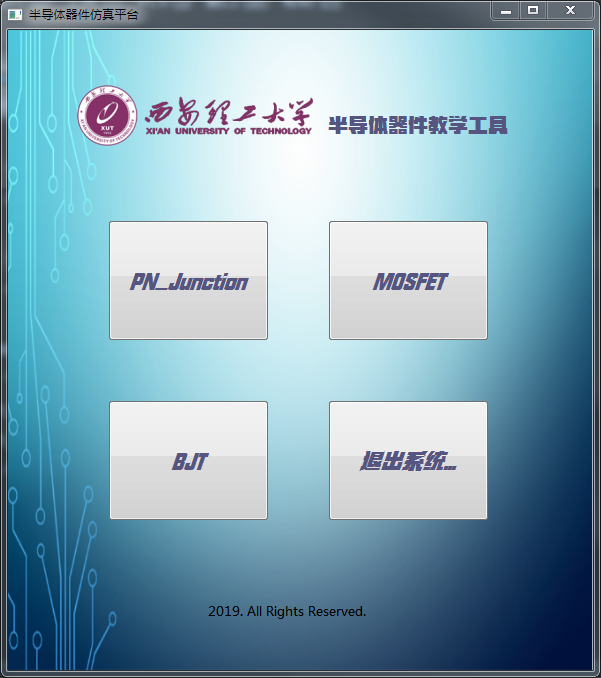
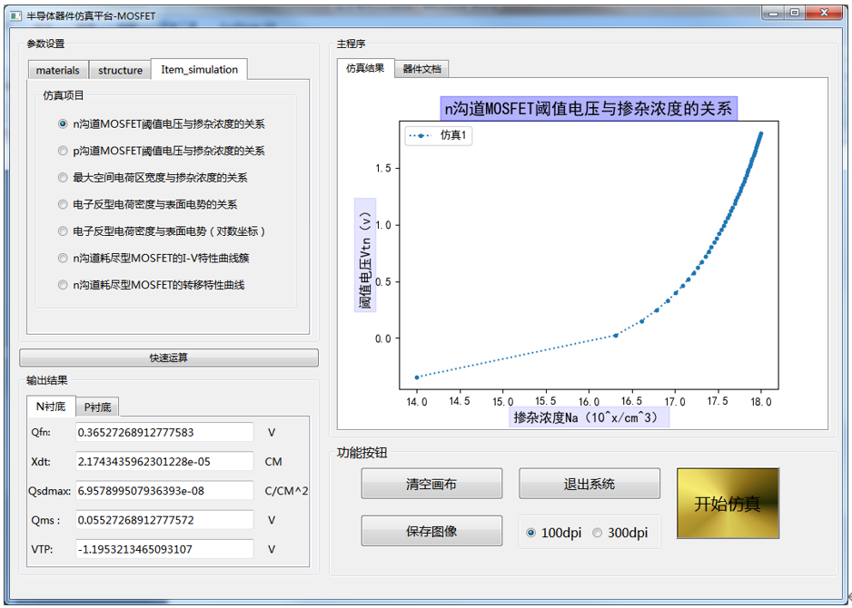
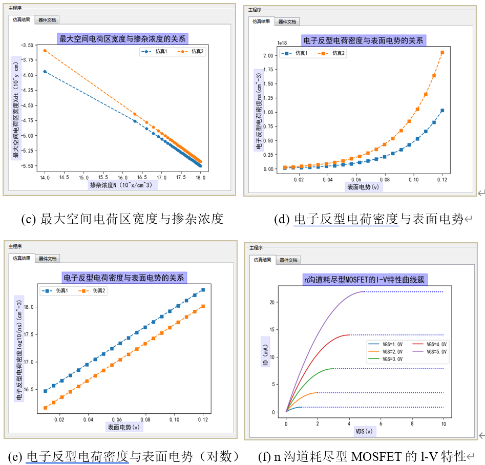
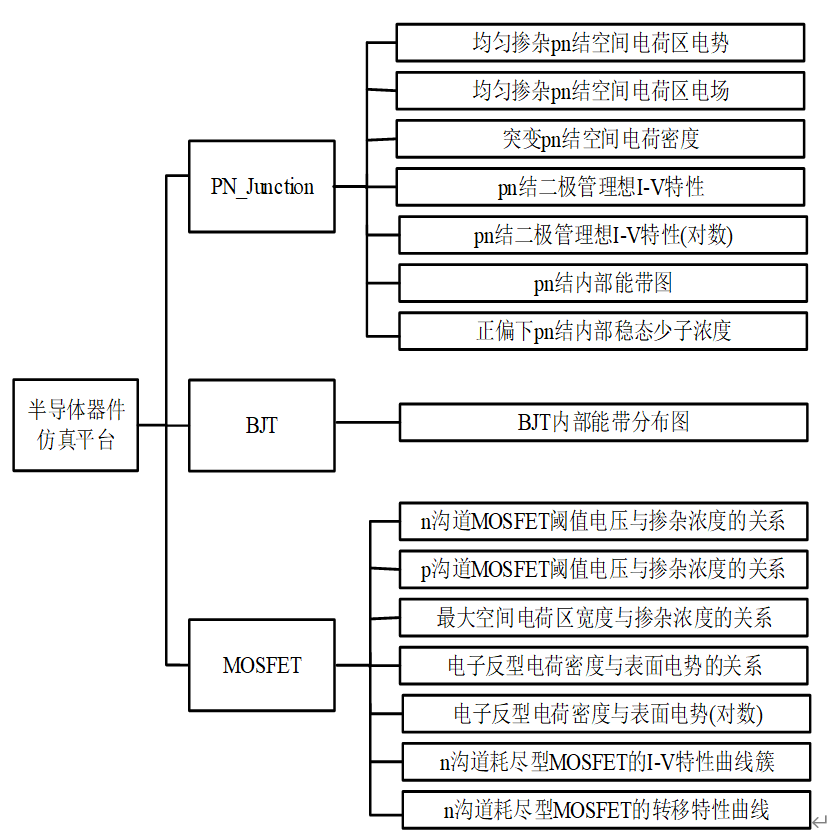
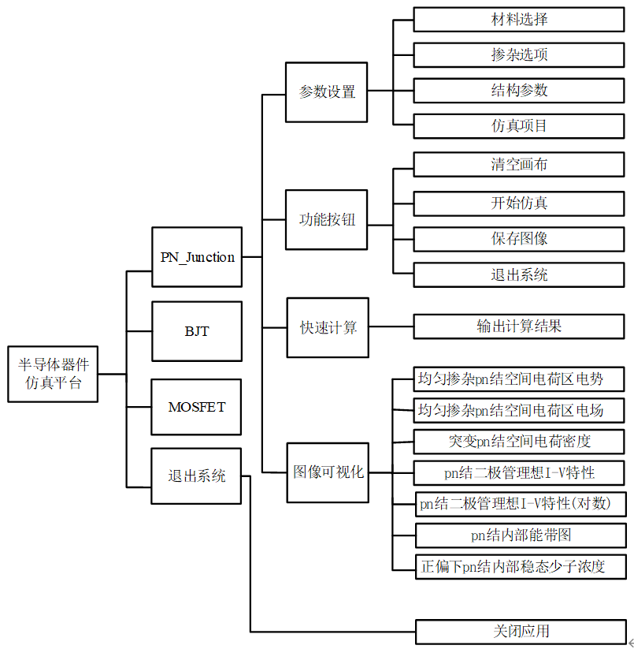

# semiconductor-simulation-platform
半导体器件仿真模拟平台（现已支持PN结、BJT、MOS管），code于2019年。
>**Note:** 由于当年的时间原因，系统在BJT器件特性部分做的还不够完善，目前只能对内部能带图进行仿真。
>有意向的同学可以在代码结构的基础上，通过对器件特性的熟练掌握与运用，将其整合进系统，使其更加完善。

## 一、系统概述

本课题针对《半导体器件物理》中涉及的三种基础器件：MOSFET，PN结，BJT，共计十五种器件特性，例如：均匀掺杂PN结空间电荷区电势，突变PN结空间电荷密度等的数学模型进行总结，整合出完整的计算方案，
制作出操作便捷且功能完善的仿真平台。该平台可以根据器件的参数，对器件特性仿真，之后实现仿真的动态可视化输出。这无论在课程教学过程中还是学生课后研究上都具有非常大的帮助，具有显著的现实意义。

- 程序入口  


- 系统主界面  


- 部分仿真结果  


- 仿真项目  


- 模块框架  



## 二、运行
```bash
python run.py
```


